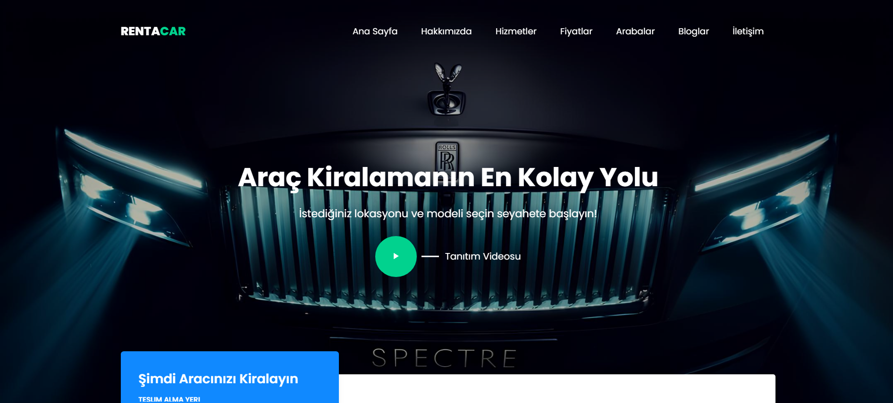

# **ASP.NET Core Web API 8.0 Onion Mimarisi ile Araç Kiralama Otomasyonu**

# Proje Özeti
- Amaç: Araç kiralama süreçlerini dijitalleştirerek verimliliği artırmak, kullanıcı deneyimini iyileştirmek ve operasyonel yönetimi kolaylaştırmak.
- Teknolojiler: ASP.NET Core Web API, Entity Framework Core, JWT, FluentValidation, Onion Architecture, HTML/CSS/JavaScript, Razor, Bootstrap, Swagger.
- Özellikler: Kullanıcılar için araç arama, rezervasyon ve ödeme; yöneticiler için araç, müşteri ve rezervasyon yönetimi.

# 🚀 Geliştirme Ortamı

- Backend: .NET Core 8.0, C#, ASP.NET Core Web API
- Frontend: HTML, CSS, JavaScript, Razor (.cshtml), Bootstrap
- Veritabanı: SQL Server (Entity Framework Core ile erişim)
- Geliştirme Araçları: Visual Studio 2022, SQL Server Management Studio
- Bağımlılıklar: Swashbuckle (Swagger), FluentValidation, Microsoft.EntityFrameworkCore

  # Projenin Yüklenmesi ve Çalıştırılması
  1. Depoyu Klonlayın:
     - git clone https://github.com/ibrahimkzilarslan/carRentalAutomation.git

  2. Bağımlılıkları Yükleyin:
     - Visual Studio'da çözümü açın (RentACar.sln).
     - NuGet Package Manager ile bağımlılıkları restore edin.
       
  3. Veritabanını Kurun:
     - appsettings.json dosyasında bağlantı dizesini (connection string) güncelleyin.
     - Terminalde proje klasörüne giderek migration'ları çalıştırın (dotnet ef database update)
       
  4.Projeyi Çalıştırın:
     - Visual Studio'da F5 tuşuna basın veya terminalde "dotnet run" komutunu çalıştırın.
     - API: https://localhost:port/swagger
     - Frontend: https://localhost:port
       
 

